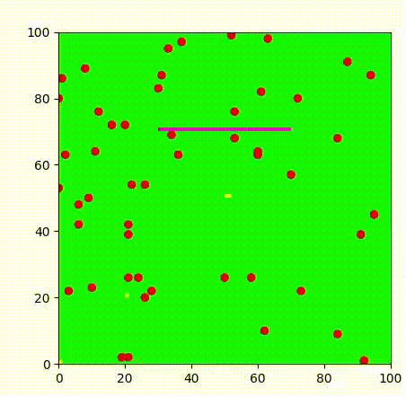
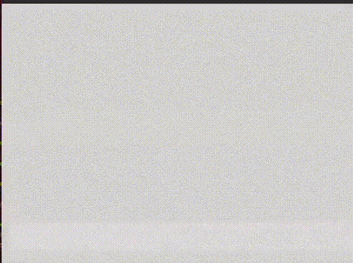

# Firefighting swarm movement
A swarm of firefighters learn a set of local rules to move and build trenches in the most efficient way to prevent the fire spread.


### Setup

Clone the repository and build

```
git clone https://github.com/laiaaa0/BioAI.git
cd BioAI
pip install virtualenv
python -m virtualenv .venv
source .venv/bin/activate
pip install -r requirements.txt
```
### Running

Running a simulation where all the points move north while the fire spreads
```
python -m  simulation.run_simulation
```

Training a network that learns the best behaviour for the firefighters

```
python -m  simulation.network
```

Plotting the best network 
```
python -m  simulation.plotBestNetwork
```


### Results

Here is how the fire spreads using the cellular automata


Here is a trained network of the fire fighters building trenches to surpress the fire

